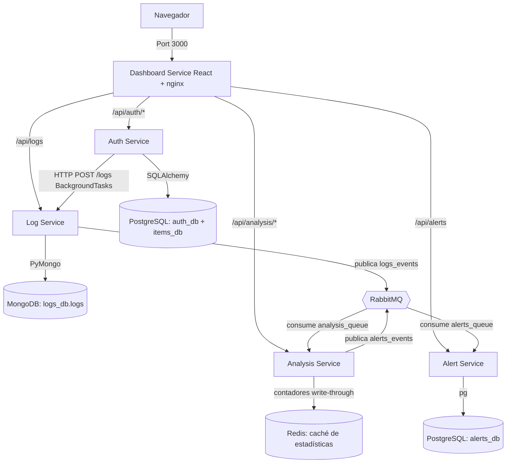

# Plataforma SOC/SIEM: Microservicios con Docker Compose

Arquitectura de microservicios independiente, estructurada en un monorepo. Consta de cinco servicios de aplicación: **Auth Service** (autenticación JWT, items y dashboard embebido), **Log Service** (recolector centralizado de logs con persistencia en MongoDB), **Analysis Service** (consumidor de eventos vía RabbitMQ con motor de reglas de detección y estadísticas persistidas en Redis), **Alert Service** (persistencia y ciclo de vida de alertas en PostgreSQL) y **Dashboard Service** (frontend React servido por nginx). Todo orquestado con **Docker Compose** junto a **PostgreSQL**, **MongoDB**, **RabbitMQ** y **Redis**.

---

> **Documentación Detallada:**
> - **Resumen para explicar el proyecto:** [`docs/PROJECT_SUMMARY.md`](docs/PROJECT_SUMMARY.md) — punto de entrada único: qué es, qué está hecho, y qué documento leer según lo que te pregunten
> - **Guía Visual:** [`docs/ARCHITECTURE_VISUAL_GUIDE.md`](docs/ARCHITECTURE_VISUAL_GUIDE.md) — Diagramas, flujos de datos, seguridad en capas
> - **Guía General:** [`docs/WEEKS_1-2_IMPLEMENTATION.md`](docs/WEEKS_1-2_IMPLEMENTATION.md) — Docker, FastAPI CRUD, API Reference, troubleshooting
> - **Guía Detallada:** [`docs/AUTH_SERVICE_ARCHITECTURE.md`](docs/AUTH_SERVICE_ARCHITECTURE.md) — Línea por línea: endpoints, ORM, Pydantic, seguridad

---


## Diseño y Arquitectura

Todos los servicios corren en contenedores independientes y se comunican a través de una red virtual interna provista por Docker Compose.



**Características principales**
- **Dashboard Service (puerto 3000) — dashboard principal del proyecto:** frontend en React (Vite + Recharts + Axios) servido por nginx, que además actúa como reverse proxy hacia los demás servicios (un solo origen, sin CORS). Login y registro con validación en vivo de requisitos de cuenta/contraseña, notificaciones toast, tabla de logs en vivo con filtros, estadísticas con gráficos y gestión de usuarios para el rol `admin`. Este es el punto de entrada de la plataforma desde la Semana 7.
- **Auth Service (puerto 8000):** API REST principal + dashboard embebido (anterior al de React; se mantiene como consola secundaria de administración de items). Gestiona registros, logins, JWT y productos. Envía logs de forma asíncrona al Log Service. El login tiene **rate limiting**: 5 intentos fallidos en 60 s para el mismo usuario bloquean ese usuario 60 s (`429 Too Many Requests`) — mismo umbral que la alerta de fuerza bruta del Analysis Service, así que la detección y el bloqueo ocurren juntos.
- **Log Service (puerto 8010):** Recolector de logs y consola web. Persiste cada evento en MongoDB y lo publica en RabbitMQ (exchange topic `logs_events`, routing key `logs.<nivel>`).
- **Analysis Service (puerto 8002):** consume los eventos de la cola `analysis_queue` (binding `logs.#`) en un hilo dedicado, les aplica el **motor de reglas de detección** (umbral, patrón regex y palabra clave — Semana 8) y publica cada alerta disparada en el exchange `alerts_events` con routing key `alerts.<severidad>`. Expone estadísticas agregadas (`/stats`, `/events/recent`) y la lista de reglas (`/rules`); los contadores se espejan en **Redis** (write-through) y se restauran al arrancar, así que sobreviven reinicios del contenedor.
- **Alert Service (puerto 8003):** servicio Node.js/Express que consume las alertas de la cola `alerts_queue` (binding `alerts.#`), las **persiste en PostgreSQL** (`alerts_db.alerts`) y expone su API de consulta y ciclo de vida: `GET /alerts` (filtros por severidad/estado), `GET /alerts/stats` y `PATCH /alerts/:id` (nueva → reconocida → cerrada). Severidades: baja, media, alta, crítica.
- **RabbitMQ (puerto 15672 expuesto; AMQP 5672 solo red interna):** broker de mensajería para la comunicación asíncrona Log Service → Analysis Service (`logs_events`) y Analysis Service → Alert Service (`alerts_events`). UI de gestión en `http://localhost:15672` (ver `.env` para credenciales).
- **MongoDB (puerto 27017, solo red interna):** almacena los logs en la base `logs_db`, colección `logs`. Log Service espera activamente (`_wait_for_mongodb`, hasta 15 reintentos) a que MongoDB acepte conexiones antes de arrancar.
- **Redis (puerto 6379, solo red interna):** caché del Analysis Service — contadores de eventos/alertas y últimos eventos, con AOF activado para que también sobrevivan reinicios del propio Redis. Sin `REDIS_HOST` definido, Analysis Service funciona solo en memoria (mismo patrón de fallback que el resto del stack).
- **PostgreSQL (puerto 5432, solo red interna):** un único servidor Postgres con tres bases de datos aisladas (`auth_db`, `items_db`, `alerts_db`), creadas automáticamente vía script de inicialización (`postgres-init/`); si el volumen ya existía antes de la Semana 8, Alert Service crea `alerts_db` por sí mismo al arrancar. Si no hay servidor Postgres disponible, Auth Service cae automáticamente a SQLite local (`data/auth.db` / `data/items.db`) — útil para desarrollo sin Docker.
- **Comunicación no bloqueante:** el Auth Service utiliza `BackgroundTasks` de FastAPI y un cliente HTTP (`requests`) para reportar eventos al Log Service sin penalizar la respuesta al cliente; el Log Service desacopla el análisis publicando a RabbitMQ.

---


## Estructura del Proyecto

```
python-docker-service/
│
├── auth-service/           Microservicio de autenticación y productos
│   ├── app.py              Código principal y dashboard embebido
│   ├── requirements.txt    Dependencias (FastAPI, JWT, SQLAlchemy, psycopg2, requests)
│   └── Dockerfile          Imagen Docker del Auth Service
│
├── log-service/            Microservicio centralizado de auditoría de logs
│   ├── app.py              Servidor de logs: persiste en MongoDB y publica a RabbitMQ
│   ├── requirements.txt    Dependencias (FastAPI, Uvicorn, PyMongo, Pika)
│   └── Dockerfile          Imagen Docker del Log Service
│
├── analysis-service/       Microservicio de análisis de eventos
│   ├── app.py              Consumidor RabbitMQ + API de estadísticas
│   ├── requirements.txt    Dependencias (FastAPI, Uvicorn, Pika)
│   └── Dockerfile          Imagen Docker del Analysis Service
│
├── dashboard-service/      Frontend React (SOC Dashboard)
│   ├── src/                Código React (páginas, API client, tema)
│   ├── nginx.conf          Servidor de estáticos + reverse proxy /api/*
│   ├── vite.config.js      Build con Vite (+ proxy de desarrollo)
│   └── Dockerfile          Build multi-stage: node → nginx
│
├── alert-service/          Microservicio de gestión de alertas (Node.js/Express)
│   ├── index.js            Consumidor RabbitMQ + persistencia Postgres + API REST
│   ├── package.json        Dependencias (Express, pg, amqplib)
│   └── Dockerfile          Imagen Docker del Alert Service
│
├── postgres-init/          Scripts SQL ejecutados al primer arranque de Postgres
│   └── 01-create-databases.sql   Crea auth_db, items_db y alerts_db
│
├── docker-compose.yml      Orquestación de contenedores, red y volúmenes
├── .env.example            Plantilla de variables de entorno/credenciales (copiar a .env)
├── run_local.bat           Script para iniciar los servicios Python localmente (usa SQLite)
└── README.md               Este archivo de documentación
```

---


## Puesta en Marcha

### Opción A: Con Docker Compose (recomendado)

Requiere tener Docker Desktop iniciado.

```bash
# 0. Copiar .env.example a .env (una sola vez) y ajustar credenciales si hace falta
cp .env.example .env

# 1. Levantar la arquitectura completa en segundo plano
#    (postgres arranca primero y espera su healthcheck antes de que
#    auth-service inicie — ver docker-compose.yml)
docker compose up -d --build

# 2. Ver logs generales en terminal:
docker compose logs -f

# 3. Detener los servicios:
docker compose down
```

### Puertos

Tabla rápida primero, ficha detallada de cada uno después — para saber no solo *qué puerto es*, sino *qué se implementa ahí* y *cómo encaja en el funcionamiento completo del proyecto*.

| Puerto | Servicio | Protocolo | Expuesto al host |
|---|---|---|---|
| 3000 | dashboard-service | HTTP | Sí |
| 8000 | auth-service | HTTP | Sí |
| 8010 | log-service | HTTP | Sí |
| 8002 | analysis-service | HTTP | Sí |
| 8003 | alert-service | HTTP | Sí |
| 15672 | rabbitmq (UI) | HTTP | Sí |
| 5672 | rabbitmq (AMQP) | AMQP | No — solo red interna |
| 5432 | postgres | TCP | No — solo red interna |
| 27017 | mongodb | TCP | No — solo red interna |
| 6379 | redis | TCP | No — solo red interna |

Los puertos marcados "solo red interna" no son alcanzables desde `localhost`; solo los usan los propios contenedores entre sí. Para inspeccionarlos manualmente:

```bash
docker exec postgres psql -U postgres -d alerts_db -c "SELECT id, rule_id, severity, status FROM alerts;"
docker exec mongodb mongosh -u root -p root --quiet --eval "db.getSiblingDB('logs_db').logs.countDocuments()"
docker exec redis redis-cli get analysis:total_eventos
```

---

#### `:3000` — Dashboard Service (React)

**Qué es:** el frontend del proyecto — lo primero que ve cualquier usuario. Es una SPA en React (Vite + Recharts + Axios) compilada a estático y servida por nginx.

**Qué se implementa aquí:** login/registro con validación en vivo, tabla de logs en tiempo real con filtros, gráficos de estadísticas, gestión de usuarios (solo rol `admin`), y una vista de Alertas en vivo con filtros por severidad/estado y botones de ciclo de vida (Reconocer / Cerrar). nginx además hace de **reverse proxy**: todas las llamadas del navegador van a `/api/*` en este mismo origen, y nginx las reenvía internamente a auth-service, log-service, analysis-service y alert-service — así el navegador nunca le habla directo a los otros puertos y no hay problemas de CORS entre pestañas.

**Por qué existe / cómo aporta:** sin esto, el proyecto sería solo APIs sueltas sin forma de demostrarlas. Es la pieza que convierte 5 microservicios backend en "un producto" que se puede mostrar y usar.

#### `:8000` — Auth Service

**Qué es:** la puerta de entrada de seguridad del sistema — FastAPI + PostgreSQL.

**Qué se implementa aquí:** registro y login de usuarios, emisión y validación de JWT, roles (`user`/`admin`), y un CRUD de "items" de ejemplo (usado para practicar operaciones protegidas por rol). También sirve un dashboard HTML embebido propio (versión anterior a la de React) como consola secundaria. Expone Swagger interactivo en `/docs`.

**Por qué existe / cómo aporta:** ningún otro servicio valida contraseñas ni emite tokens — todos los demás confían en el JWT que este servicio firma. Es el único que toca directamente las contraseñas de los usuarios, así que es también la pieza donde más importa la seguridad (hashing con bcrypt, expiración de token, CORS restringido).

#### `:8010` — Log Service

**Qué es:** el recolector centralizado de eventos — el punto donde "nace" todo lo que después se analiza. FastAPI + MongoDB + RabbitMQ.

**Qué se implementa aquí:** recibe eventos por HTTP (`POST /logs`) desde cualquier otro servicio, los guarda en MongoDB (`logs_db.logs`) y publica cada uno en RabbitMQ (exchange `logs_events`, routing key `logs.<nivel>`) para que quien quiera consumirlos en tiempo real pueda hacerlo sin tocar Mongo directamente. También sirve una consola web propia para ver el flujo de logs en vivo.

**Por qué existe / cómo aporta:** es la base de todo SIEM — sin recolección y persistencia de eventos no hay nada que analizar ni correlacionar después. Es intencionalmente "tonto" (no analiza nada, solo guarda y reenvía) para mantener el desacople: si Analysis Service se cae, los logs igual se siguen guardando.

#### `:8002` — Analysis Service

**Qué es:** el consumidor de eventos — FastAPI corriendo un hilo consumidor de RabbitMQ en paralelo al servidor web.

**Qué se implementa aquí:** un hilo dedicado consume la cola `analysis_queue` (todo lo publicado bajo `logs.#`), mantiene contadores en memoria (total de eventos, por nivel, por servicio, últimos eventos) y le aplica a cada evento el **motor de reglas de detección** (Semana 8): reglas de umbral (N eventos coincidentes en una ventana de tiempo — p. ej. 5 logins fallidos en 60 s → posible fuerza bruta), de patrón regex (p. ej. token JWT manipulado, intentos de inyección) y de palabra clave (p. ej. accesos denegados). Cada alerta disparada lleva severidad (`baja`/`media`/`alta`/`critica`) y se publica en el exchange `alerts_events` con routing key `alerts.<severidad>`. Expone `/stats`, `/events/recent` y `/rules`.

**Por qué existe / cómo aporta:** es el paso intermedio entre "tener logs guardados" y "tener alertas de seguridad" — el corazón analítico del SIEM. Decide qué eventos son ruido y cuáles merecen una alerta con severidad; sin él, el sistema solo tendría un histórico de logs sin procesar.

#### `:8003` — Alert Service

**Qué es:** el gestor del ciclo de vida de alertas — Node.js/Express + PostgreSQL + RabbitMQ (el único servicio de aplicación que no es Python/React, a propósito, para practicar un stack políglota).

**Qué se implementa aquí:** un consumidor amqplib lee la cola `alerts_queue` (binding `alerts.#`) y persiste cada alerta en PostgreSQL (`alerts_db.alerts`, con el evento original en una columna JSONB). Sobre esa tabla expone la API de gestión: `GET /alerts` con filtros por severidad y estado, `GET /alerts/stats` con conteos agregados, y `PATCH /alerts/:id` para el ciclo de vida del incidente (nueva → reconocida → cerrada). Al arrancar crea `alerts_db` y la tabla por sí mismo si no existen.

**Por qué existe / cómo aporta:** las alertas del Analysis Service serían efímeras (se perderían al reiniciar) — este servicio las convierte en incidentes persistentes y gestionables, que es justo el objetivo final del proyecto: "ver alertas activas con su severidad" desde el dashboard y poder cerrarlas.

#### `:15672` / `:5672` — RabbitMQ

**Qué es:** el broker de mensajería — el "cartero" que desacopla los dos tramos asíncronos: Log Service → Analysis Service y Analysis Service → Alert Service.

**Qué se implementa aquí:** Log Service publica cada evento nuevo al exchange `logs_events` (lo consume Analysis Service vía `analysis_queue`); Analysis Service publica cada alerta disparada al exchange `alerts_events` (lo consume Alert Service vía `alerts_queue`) — en ambos casos el publicador no necesita saber quién escucha. `:15672` es la interfaz web de administración (ver colas, mensajes, exchanges); `:5672` es el protocolo real (AMQP) que usan los servicios entre sí, por eso no necesita estar expuesto al host.

**Por qué existe / cómo aporta:** es lo que permite que Log Service siga funcionando aunque Analysis Service esté caído (o viceversa) — comunicación asíncrona en vez de llamadas directas que fallarían en cadena. Es la pieza que hace que la arquitectura sea de microservicios de verdad, y no solo varios servicios que se llaman entre sí por HTTP.

#### `:5432` — PostgreSQL

**Qué es:** la base de datos relacional del proyecto — usuarios y datos estructurados.

**Qué se implementa aquí:** tres bases lógicas separadas en el mismo servidor: `auth_db` (usuarios, contraseñas hasheadas, roles), `items_db` (el CRUD de ejemplo) y `alerts_db` (las alertas del SIEM con su estado). Las dos primeras se crean al primer arranque vía `postgres-init/`; `alerts_db` también, o la crea Alert Service al arrancar si el volumen es anterior a la Semana 8.

**Por qué existe / cómo aporta:** los datos de usuarios necesitan integridad transaccional (que un registro no quede a medias, que los roles no se dupliquen) — por eso son relacionales y no van en Mongo junto con los logs. Si Postgres no está disponible, Auth Service cae automáticamente a SQLite local, lo que permite desarrollar sin tener Docker corriendo.

#### `:27017` — MongoDB

**Qué es:** la base de datos documental — donde viven los logs/eventos crudos.

**Qué se implementa aquí:** la colección `logs_db.logs`, un documento JSON por cada evento recibido (servicio, nivel, mensaje, timestamp). Se eligió Mongo porque los logs no tienen una estructura fija ni relaciones entre sí — son documentos independientes que solo se necesita guardar rápido y filtrar después.

**Por qué existe / cómo aporta:** separar "datos estructurados con relaciones" (Postgres) de "eventos en bruto de alto volumen" (Mongo) es una decisión de arquitectura real de un SIEM — cada base de datos hace lo que mejor sabe hacer, en vez de forzar todo en una sola.

#### `:6379` — Redis

**Qué es:** el almacén clave-valor en memoria — la capa de caché del Analysis Service.

**Qué se implementa aquí:** los contadores agregados (`analysis:total_eventos`, `analysis:por_nivel`, `analysis:alertas_por_severidad`...) y la lista de últimos eventos (`analysis:eventos_recientes`). El Analysis Service escribe cada evento en memoria y en Redis a la vez (write-through, con `pipeline` para que sea un solo round-trip) y al arrancar restaura los valores desde Redis. AOF (`--appendonly yes`) hace que los datos sobrevivan también reinicios del contenedor de Redis.

**Por qué existe / cómo aporta:** antes de Redis, las estadísticas de `/stats` vivían solo en la memoria del proceso — un reinicio del contenedor las reseteaba a cero. Con Redis, el histórico agregado es estable sin necesidad de recalcularlo desde MongoDB, que es exactamente el rol de una capa de caché en un SIEM: lecturas rápidas de datos ya digeridos.

### Opción B: Sin Docker (localmente en Windows)

Requiere tener creado el entorno virtual `venv` en la raíz. Sin `POSTGRES_HOST` definido, Auth Service usa automáticamente SQLite local (`data/auth.db`, `data/items.db`) — no hace falta tener Postgres instalado para desarrollo local.

```bash
# 1. Ejecutar el script batch de arranque
#    (abre dos ventanas de comandos ejecutando ambos servicios)
./run_local.bat

# 2. Acceder en el navegador:
#    http://localhost:8000        Auth Service & Dashboard
#    http://localhost:8010        Log Service Monitor
```

Explicación detallada de cada comando y script (`docker compose build`, `run_local.bat`, `test_crud.py`, los scripts de `postgres-init/`, etc.): [`docs/WEEKS_1-2_IMPLEMENTATION.md`](docs/WEEKS_1-2_IMPLEMENTATION.md#command--script-reference).

---


## Endpoints de Microservicios

### Auth Service (`http://localhost:8000`)

| Método | Endpoint | Tags | Descripción |
|--------|----------|------|-------------|
| `POST` | `/auth/register` | Auth | Registrar un nuevo usuario (rol `user` por defecto) |
| `POST` | `/auth/login` | Auth | Obtener token JWT Bearer |
| `GET` | `/auth/me` | Auth | Perfil del usuario activo decodificado desde JWT |
| `GET` | `/auth/users` | Auth | Listar usuarios (solo `admin`) |
| `GET` | `/api/items` | Items | Listar todos los productos del inventario |
| `POST` | `/api/items` | Items | Crear un producto asociado al usuario |
| `PUT` | `/api/items/{id}` | Items | Modificar un producto (solo `admin`) |
| `DELETE`| `/api/items/{id}` | Items | Eliminar producto del sistema (solo `admin`) |
| `GET` | `/api/health` | System| Estado del Auth Service |

### Log Service (`http://localhost:8010`)

| Método | Endpoint | Tags | Descripción |
|--------|----------|------|-------------|
| `GET` | `/` | Web | Consola de monitoreo con auto-refresco |
| `POST` | `/logs` | Logs | Registrar un evento: lo persiste en MongoDB y lo publica a RabbitMQ |
| `GET` | `/logs` | Logs | Consultar / filtrar logs almacenados en MongoDB |

### Analysis Service (`http://localhost:8002`)

| Método | Endpoint | Tags | Descripción |
|--------|----------|------|-------------|
| `GET` | `/health` | System | Estado del Analysis Service |
| `GET` | `/stats` | Análisis | Estadísticas agregadas de eventos consumidos (por nivel, por servicio) |
| `GET` | `/events/recent` | Análisis | Últimos eventos consumidos desde RabbitMQ (máx. 50 en memoria) |

### Dashboard Service (`http://localhost:3000`) — dashboard principal

Frontend React sin API propia. Su nginx expone la SPA en `/` y reenvía `/api/auth/*` → Auth Service, `/api/logs` → Log Service y `/api/analysis/*` → Analysis Service. Incluye: login/registro (con validación en vivo de los requisitos del Auth Service: usuario 3–50 caracteres, contraseña de mínimo 6 caracteres y sin caracteres repetitivos como `111111` — regla también aplicada en el backend), logs en tiempo real con filtros, estadísticas con gráficos, y gestión de usuarios (solo `admin`).

---


## Persistencia de Datos en Docker

Docker Compose define tres volúmenes persistentes con drivers locales:

1. **`postgres_data`** (montado en `/var/lib/postgresql/data` del contenedor `postgres`): persiste ambas bases de datos (`auth_db`, `items_db`) entre reinicios. Las bases se crean una única vez, en el primer arranque, vía `postgres-init/01-create-databases.sql`.
2. **`mongo_data`** (montado en `/data/db` del contenedor `mongodb`): persiste la base `logs_db` (colección `logs`) entre reinicios.
3. **`rabbitmq_data`** (montado en `/var/lib/rabbitmq` del contenedor `rabbitmq`): persiste colas y mensajes durables (exchange `logs_events`, cola `analysis_queue`) entre reinicios.

**Variables de entorno de conexión de Auth Service** (definidas en `docker-compose.yml`, con valores tomados de `.env`): `POSTGRES_HOST=postgres`, `POSTGRES_PORT=5432`, `POSTGRES_USER`/`POSTGRES_PASSWORD` (`${POSTGRES_USER}`/`${POSTGRES_PASSWORD}`), `JWT_SECRET_KEY`, `CORS_ORIGINS`. Auth Service espera activamente (`_wait_for_postgres`, hasta 15 reintentos) a que Postgres acepte conexiones antes de crear las tablas — necesario porque el healthcheck de Docker garantiza que el proceso esté "healthy" pero no elimina toda condición de carrera en el primer arranque.

**Variables de entorno de conexión de Log Service**: `MONGO_HOST=mongodb`, `MONGO_PORT=27017`, `MONGO_DATABASE=logs_db`, `MONGO_USERNAME`/`MONGO_PASSWORD`, más `RABBITMQ_HOST/PORT/USER/PASSWORD` para publicar eventos y `CORS_ORIGINS` (todos tomados de `.env` vía `docker-compose.yml`). Log Service usa el mismo patrón de espera activa (`_wait_for_mongodb`) antes de aceptar peticiones; si `RABBITMQ_HOST` no está definido, funciona sin cola (solo MongoDB).

**Variables de entorno del Analysis Service**: `RABBITMQ_HOST=rabbitmq`, `RABBITMQ_PORT=5672`, `RABBITMQ_USER`/`RABBITMQ_PASSWORD`, `CORS_ORIGINS` (tomados de `.env`). El hilo consumidor espera activamente (`_wait_for_rabbitmq`, hasta 15 reintentos) y se reconecta solo si la conexión se cae.

Todas las credenciales y secretos viven en `.env` (no versionado, ver `.gitignore`); `.env.example` documenta cada variable con su valor por defecto de desarrollo.
