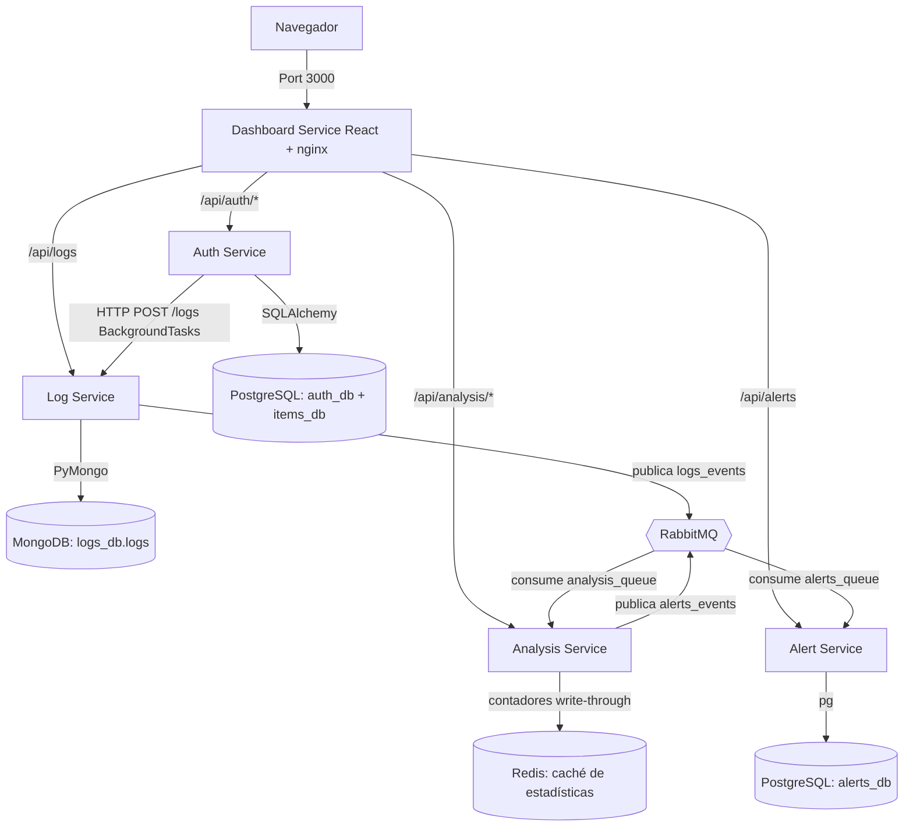

# Plataforma SOC/SIEM: Microservicios con Docker Compose

Repositorio: [github.com/TomasGarco/Proeycto-Ciberseguridad](https://github.com/TomasGarco/Proeycto-Ciberseguridad)

Arquitectura de microservicios independiente, estructurada en un monorepo. Consta de cinco servicios de aplicación: **Auth Service** (autenticación JWT, items y dashboard embebido), **Log Service** (recolector centralizado de logs con persistencia en MongoDB), **Analysis Service** (consumidor de eventos vía RabbitMQ con motor de reglas de detección y estadísticas persistidas en Redis), **Alert Service** (persistencia y ciclo de vida de alertas en PostgreSQL) y **Dashboard Service** (frontend React servido por nginx). Todo orquestado con **Docker Compose** junto a **PostgreSQL**, **MongoDB**, **RabbitMQ** y **Redis**.

---

## 🔗 Acceso rápido

Con el stack levantado (`docker compose up -d --build`), estos son todos los links a los que se puede entrar desde el navegador:

| Servicio | Link | Qué vas a ver |
|---|---|---|
| **Dashboard** — punto de entrada principal | **[https://localhost](https://localhost)** (`:3000` redirige a `:443`) | Login, logs en vivo, estadísticas, alertas, CRUD de artículos, gestión de usuarios |
| Auth Service — API + Swagger | [http://localhost:8000/docs](http://localhost:8000/docs) | Documentación interactiva de todos los endpoints de auth/items |
| Auth Service — consola legacy | [http://localhost:8000](http://localhost:8000) | Dashboard HTML embebido (versión anterior al de React) |
| Log Service — consola web | [http://localhost:8010](http://localhost:8010) | Monitor de logs en vivo con auto-refresco |
| Analysis Service — Swagger | [http://localhost:8002/docs](http://localhost:8002/docs) | `/stats`, `/events/recent`, `/rules` |
| Alert Service — API | [http://localhost:8003/alerts](http://localhost:8003/alerts) | Alertas en JSON (sin interfaz propia, se consume desde el Dashboard) |
| RabbitMQ — panel de administración | [http://localhost:15672](http://localhost:15672) | Colas, mensajes y exchanges — usuario/clave en `.env` (por defecto `guest`/`guest`) |

Postgres, MongoDB y Redis **no tienen link** — no están expuestos al navegador a propósito (solo los usan los servicios entre sí). Para inspeccionarlos hay que usar `docker exec` (comandos en la sección [Puertos](#puertos) más abajo).

**Sobre el candado de `https://localhost`:** el certificado por defecto es autofirmado (generado con `certs/generate-dev-cert.sh`, ver sección [HTTPS](#https)), así que el navegador va a mostrar una advertencia de seguridad la primera vez — es esperado en desarrollo, hay que aceptar la excepción una sola vez. Si esa advertencia molesta (por ejemplo, porque el puerto 3000 se sigue viendo "No seguro" hasta aceptarla), existe una alternativa sin warning: generar el certificado con `certs/generate-dev-cert-mkcert.sh` en vez del script por defecto — ver sección [HTTPS](#https).

---

> **Documentación Detallada:**
> - **Resumen para explicar el proyecto:** [`docs/PROJECT_SUMMARY.md`](docs/PROJECT_SUMMARY.md) — punto de entrada único: qué es, qué está hecho, y qué documento leer según lo que te pregunten
> - **Guía Visual:** [`docs/ARCHITECTURE_VISUAL_GUIDE.md`](docs/ARCHITECTURE_VISUAL_GUIDE.md) — Diagramas, flujos de datos, seguridad en capas
> - **Guía General:** [`docs/WEEKS_1-2_IMPLEMENTATION.md`](docs/WEEKS_1-2_IMPLEMENTATION.md) — Docker, FastAPI CRUD, API Reference, troubleshooting
> - **Guía Detallada:** [`docs/AUTH_SERVICE_ARCHITECTURE.md`](docs/AUTH_SERVICE_ARCHITECTURE.md) — Línea por línea: endpoints, ORM, Pydantic, seguridad

---


## Diseño y Arquitectura

Todos los servicios corren en contenedores independientes y se comunican a través de una red virtual interna provista por Docker Compose.



**Características principales**
- **Dashboard Service ([puerto 3000](http://localhost:3000)) — dashboard principal del proyecto:** frontend en React (Vite + Recharts + Axios) servido por nginx, que además actúa como reverse proxy hacia los demás servicios (un solo origen, sin CORS). Login y registro con validación en vivo de requisitos de cuenta/contraseña (con mostrar/ocultar contraseña y errores anclados a cada campo), notificaciones toast, tabla de logs en vivo con filtros, estadísticas con gráficos, alertas con búsqueda/orden/detalle del evento disparador, **CRUD de artículos** y gestión de usuarios (cambio de rol) para el rol `admin`. Panel diferenciado por rol: un usuario `analista` ve las mismas pantallas de solo consulta, pero no puede editar/eliminar artículos, cambiar roles ni reconocer/cerrar alertas. Este es el punto de entrada de la plataforma desde la Semana 7.
- **Auth Service ([puerto 8000](http://localhost:8000)):** API REST principal + dashboard embebido (anterior al de React; se mantiene como consola secundaria de administración de items). Gestiona registros, logins, JWT, productos y roles de usuario. Envía logs de forma asíncrona al Log Service. El login tiene **rate limiting**: 5 intentos fallidos en 60 s para el mismo usuario bloquean ese usuario 60 s (`429 Too Many Requests`) — mismo umbral que la alerta de fuerza bruta del Analysis Service, así que la detección y el bloqueo ocurren juntos. **Política de contraseña**: mínimo 8 caracteres, con mayúscula, minúscula, número y al menos 3 caracteres distintos.
- **Log Service ([puerto 8010](http://localhost:8010)):** Recolector de logs y consola web. Persiste cada evento en MongoDB y lo publica en RabbitMQ (exchange topic `logs_events`, routing key `logs.<nivel>`).
- **Analysis Service ([puerto 8002](http://localhost:8002)):** consume los eventos de la cola `analysis_queue` (binding `logs.#`) en un hilo dedicado, les aplica el **motor de reglas de detección** (umbral, patrón regex y palabra clave — Semana 8) y publica cada alerta disparada en el exchange `alerts_events` con routing key `alerts.<severidad>`. Expone estadísticas agregadas (`/stats`, `/events/recent`) y la lista de reglas (`/rules`); los contadores se espejan en **Redis** (write-through) y se restauran al arrancar, así que sobreviven reinicios del contenedor.
- **Alert Service ([puerto 8003](http://localhost:8003)):** servicio Node.js/Express que consume las alertas de la cola `alerts_queue` (binding `alerts.#`), las **persiste en PostgreSQL** (`alerts_db.alerts`) y expone su API de consulta y ciclo de vida: `GET /alerts` (filtros por severidad/estado), `GET /alerts/stats` y `PATCH /alerts/:id` (nueva → reconocida → cerrada). Severidades: baja, media, alta, crítica. **`PATCH /alerts/:id` requiere JWT válido con rol `admin`** (Semana 10) — las lecturas siguen abiertas.
- **RabbitMQ ([puerto 15672](http://localhost:15672) expuesto; AMQP 5672 solo red interna):** broker de mensajería para la comunicación asíncrona Log Service → Analysis Service (`logs_events`) y Analysis Service → Alert Service (`alerts_events`). UI de gestión en [http://localhost:15672](http://localhost:15672) (ver `.env` para credenciales).
- **MongoDB (puerto 27017, solo red interna):** almacena los logs en la base `logs_db`, colección `logs`. Log Service espera activamente (`_wait_for_mongodb`, hasta 15 reintentos) a que MongoDB acepte conexiones antes de arrancar.
- **Redis (puerto 6379, solo red interna):** caché del Analysis Service — contadores de eventos/alertas y últimos eventos, con AOF activado para que también sobrevivan reinicios del propio Redis. Sin `REDIS_HOST` definido, Analysis Service funciona solo en memoria (mismo patrón de fallback que el resto del stack).
- **PostgreSQL (puerto 5432, solo red interna):** un único servidor Postgres con tres bases de datos aisladas (`auth_db`, `items_db`, `alerts_db`), creadas automáticamente vía script de inicialización (`postgres-init/`); si el volumen ya existía antes de la Semana 8, Alert Service crea `alerts_db` por sí mismo al arrancar. Si no hay servidor Postgres disponible, Auth Service cae automáticamente a SQLite local (`data/auth.db` / `data/items.db`) — útil para desarrollo sin Docker.
- **Comunicación no bloqueante:** el Auth Service utiliza `BackgroundTasks` de FastAPI y un cliente HTTP (`requests`) para reportar eventos al Log Service sin penalizar la respuesta al cliente; el Log Service desacopla el análisis publicando a RabbitMQ.

---


## Estructura del Proyecto

```
python-docker-service/
│
│  ── Microservicios (un contenedor cada uno) ──────────────────────────
│
├── auth-service/           Microservicio de autenticación y productos (FastAPI, :8000)
│   ├── README.md           Endpoints, variables de entorno y tests de este servicio
│   ├── app.py              Código principal y dashboard embebido
│   ├── requirements.txt    Dependencias (FastAPI, JWT, SQLAlchemy, psycopg2, requests)
│   ├── requirements-dev.txt  Dependencias extra para correr los tests (pytest, httpx)
│   ├── tests/              Tests pytest del servicio (auth, roles, rate limit)
│   ├── data/               SQLite local (auth.db) — solo en modo local, no versionado
│   └── Dockerfile          Imagen Docker del Auth Service
│
├── log-service/            Microservicio centralizado de auditoría de logs (FastAPI, :8010)
│   ├── README.md           Endpoints, variables de entorno y tests de este servicio
│   ├── app.py              Servidor de logs: persiste en MongoDB y publica a RabbitMQ
│   ├── requirements.txt    Dependencias (FastAPI, Uvicorn, PyMongo, Pika)
│   ├── requirements-dev.txt  Dependencias extra para correr los tests (pytest, httpx)
│   ├── tests/              Tests pytest del servicio (registro/consulta de logs, JWT)
│   └── Dockerfile          Imagen Docker del Log Service
│
├── analysis-service/       Microservicio de análisis de eventos (FastAPI, :8002)
│   ├── README.md           Endpoints, variables de entorno y tests de este servicio
│   ├── app.py              Consumidor RabbitMQ + motor de reglas + API de estadísticas
│   ├── requirements.txt    Dependencias (FastAPI, Uvicorn, Pika, Redis)
│   ├── requirements-dev.txt  Dependencias extra para correr los tests (pytest)
│   ├── tests/              Tests pytest del motor de reglas de detección
│   └── Dockerfile          Imagen Docker del Analysis Service
│
├── alert-service/          Microservicio de gestión de alertas (Node.js/Express, :8003)
│   ├── README.md           Endpoints, variables de entorno y tests de este servicio
│   ├── index.js            Consumidor RabbitMQ + persistencia Postgres + API REST
│   ├── package.json        Dependencias (Express, pg, amqplib)
│   └── Dockerfile          Imagen Docker del Alert Service
│
├── dashboard-service/      Frontend React — SOC Dashboard (nginx, :3000 → https :443)
│   ├── README.md           Pantallas, stack y variables de entorno de este servicio
│   ├── src/                Código React (páginas, API client, tema)
│   ├── index.html          Punto de entrada del build de Vite
│   ├── package.json        Dependencias (React, axios, Vite)
│   ├── nginx.conf          Servidor de estáticos + reverse proxy /api/* + TLS
│   ├── ratelimit.conf      Zona de rate limiting de nginx para /api/*
│   ├── vite.config.js      Build con Vite (+ proxy de desarrollo)
│   └── Dockerfile          Build multi-stage: node → nginx
│
│  ── Infraestructura y utilidades ─────────────────────────────────────
│
├── postgres-init/          Scripts SQL ejecutados al primer arranque de Postgres
│   └── 01-create-databases.sql   Crea auth_db, items_db y alerts_db
│
├── certs/                  Certificado TLS de desarrollo (dev.crt/dev.key no versionados)
│   ├── generate-dev-cert.sh          Genera certs/dev.crt y certs/dev.key (autofirmado, con openssl)
│   └── generate-dev-cert-mkcert.sh   Alternativa: certificado confiado por el sistema (con mkcert, sin advertencia)
│
├── scripts/
│   ├── backup.sh           Exporta las 4 bases (Postgres x3 + MongoDB) con timestamp
│   ├── restore.sh          Restaura un backup generado por backup.sh
│   ├── backup-scheduled.bat  Wrapper de backup.sh para el Programador de tareas de Windows
│   └── gen_docs.py         Regenera docs/AUTH_SERVICE_ARCHITECTURE.md desde el código
│
├── backups/                Destino de los respaldos de scripts/backup.sh (ver su README)
│                           Vacía hasta el primer backup; su contenido no se versiona
│
├── docs/                   Documentación técnica del proyecto
│   ├── PROJECT_SUMMARY.md            Resumen ejecutivo del stack completo
│   ├── ARCHITECTURE_VISUAL_GUIDE.md  Diagramas de la arquitectura
│   ├── AUTH_SERVICE_ARCHITECTURE.md  Detalle del Auth Service (generado por gen_docs.py)
│   └── WEEKS_1-2_IMPLEMENTATION.md   Notas de la implementación inicial
│
├── data/                   SQLite local (items.db) — solo en modo local, no versionado
│
│  ── Archivos raíz ────────────────────────────────────────────────────
│
├── docker-compose.yml      Orquestación de los 9 contenedores, red y volúmenes
├── .env                    Credenciales reales del stack (NO se versiona)
├── .env.example            Plantilla de variables de entorno (copiar a .env y ajustar)
├── .gitignore              Excluye de git: .env, data/, certs (crt/key), backups/, etc.
├── .dockerignore           Excluye archivos del contexto de build de las imágenes
├── run_local.bat           Modo local sin Docker: levanta auth y log service con SQLite
├── test_crud.py            Prueba de humo del CRUD de items (hace login JWT primero)
└── README.md               Este archivo de documentación
```

---


## Puesta en Marcha

### Opción A: Con Docker Compose (recomendado)

Requiere tener Docker Desktop iniciado.

```bash
# 0. Copiar .env.example a .env (una sola vez) y ajustar credenciales si hace falta
cp .env.example .env

# 0.5. Generar el certificado TLS de desarrollo (una sola vez; certs/ no se
#      versiona, ver sección HTTPS más abajo)
docker run --rm -v "$(pwd)/certs:/certs" alpine sh -c \
  "apk add --no-cache openssl >/dev/null 2>&1 && sh /certs/generate-dev-cert.sh"

# 1. Levantar la arquitectura completa en segundo plano
#    (postgres arranca primero y espera su healthcheck antes de que
#    auth-service inicie — ver docker-compose.yml)
docker compose up -d --build

# 2. Ver logs generales en terminal:
docker compose logs -f

# 3. Detener los servicios:
docker compose down
```

### HTTPS

El Dashboard Service sirve por HTTPS en el puerto `443` (`https://localhost`); el puerto `3000` sigue existiendo solo para redirigir automáticamente a `443` (`301 Moved Permanently`) — por eso entrar a `http://localhost:3000` directo también termina en `https://localhost`, aunque de paso muestre el candado roto hasta que se acepte (o se confíe) el certificado.

Por defecto el certificado es **autofirmado**, generado con `certs/generate-dev-cert.sh` — el navegador va a mostrar una advertencia de seguridad ("la conexión no es privada" o similar) la primera vez, porque no está firmado por una autoridad certificadora reconocida. Hay que aceptar la excepción una vez; es el comportamiento esperado en un entorno de desarrollo local, no un error.

**Para eliminar la advertencia por completo** (recomendado si vas a usar el dashboard seguido): generar el certificado con [mkcert](https://github.com/FiloSottile/mkcert) en vez del script por defecto. mkcert crea una autoridad certificadora local y la instala en el almacén de confianza del sistema operativo/navegador, así que el certificado de `https://localhost` queda confiado automáticamente, sin ningún warning.

```bash
# Una sola vez por máquina de desarrollo:
mkcert -install                              # instala la CA local como confiable (pide admin/UAC una vez)
sh certs/generate-dev-cert-mkcert.sh         # genera certs/dev.crt y certs/dev.key firmados por esa CA

# Reconstruir el dashboard para que tome el certificado nuevo:
docker compose up -d --build dashboard-service
```

El tramo nginx → microservicios backend (Auth, Log, Analysis, Alert) sigue en HTTP plano, porque viaja únicamente dentro de la red interna de Docker Compose, no expuesta al host — es el mismo patrón que usa cualquier balanceador o reverse proxy que termina TLS en un solo punto de entrada.

Para producción real, `certs/dev.crt`/`certs/dev.key` se reemplazarían por un certificado emitido por una autoridad certificadora pública (por ejemplo, Let's Encrypt), sin cambiar la configuración de `nginx.conf` más allá de la ruta de los archivos.

### Backups

Los datos viven únicamente en los volúmenes Docker (`postgres_data`, `mongo_data`, `rabbitmq_data`, `redis_data`). Si se pierde el volumen, se pierde el dato — por eso hay un backup diario automático además del manual.

**Automático:** una Tarea Programada de Windows ("SOC-SIEM Backup Diario") corre `scripts/backup-scheduled.bat` todos los días a las 3:00 AM. Requiere que la sesión de Windows esté iniciada a esa hora (no corre con la PC apagada ni desde la pantalla de bloqueo sin sesión activa — es una tarea de usuario, no de sistema). El log de cada corrida queda en `scripts/backup.log` (no versionado). Para ver/editar la tarea: `schtasks /Query /TN "SOC-SIEM Backup Diario" /V /FO LIST`, o desde el Programador de tareas de Windows.

**Manual:** `scripts/backup.sh` exporta las 4 bases (`auth_db`, `items_db`, `alerts_db` de PostgreSQL vía `pg_dump`; `logs_db` de MongoDB vía `mongodump`) a una carpeta con timestamp, para correr antes de una demo importante o un cambio grande:

```bash
# Con el stack levantado, desde la raíz del repo:
sh scripts/backup.sh
# Genera: backups/<fecha_hora>/{auth_db,items_db,alerts_db}.sql + logs_db.archive
```

Para restaurar un backup (sobreescribe los datos actuales, sin confirmación — usar con cuidado):

```bash
sh scripts/restore.sh backups/20260709_170000
```

`backups/` y `scripts/backup.log` no se versionan (ver `.gitignore`) porque contienen datos reales de usuarios y eventos.

### Puertos

Tabla rápida primero, ficha detallada de cada uno después — para saber no solo *qué puerto es*, sino *qué se implementa ahí* y *cómo encaja en el funcionamiento completo del proyecto*.

| Puerto | Servicio | Protocolo | Expuesto al host |
|---|---|---|---|
| 443 | dashboard-service | HTTPS | Sí — punto de entrada principal |
| 3000 | dashboard-service | HTTP | Sí, solo redirige a `443` |
| 8000 | auth-service | HTTP | Sí |
| 8010 | log-service | HTTP | Sí |
| 8002 | analysis-service | HTTP | Sí |
| 8003 | alert-service | HTTP | Sí |
| 15672 | rabbitmq (UI) | HTTP | Sí |
| 5672 | rabbitmq (AMQP) | AMQP | No — solo red interna |
| 5432 | postgres | TCP | No — solo red interna |
| 27017 | mongodb | TCP | No — solo red interna |
| 6379 | redis | TCP | No — solo red interna |

Los puertos marcados "solo red interna" no son alcanzables desde `localhost`; solo los usan los propios contenedores entre sí. Para inspeccionarlos manualmente:

```bash
docker exec postgres psql -U postgres -d alerts_db -c "SELECT id, rule_id, severity, status FROM alerts;"
docker exec mongodb mongosh -u root -p root --quiet --eval "db.getSiblingDB('logs_db').logs.countDocuments()"
docker exec redis redis-cli get analysis:total_eventos
```

El puerto `5672` (AMQP) no tiene un comando de inspección equivalente — no es una base de datos con CLI de consulta, es el protocolo binario que usan los servicios entre sí para publicar/consumir mensajes. Su forma de inspección es la interfaz web de RabbitMQ en `:15672` (ver credenciales en `.env`), donde se pueden ver colas, exchanges y mensajes en vivo sin tocar la terminal.

---

#### `:443` / `:3000` — Dashboard Service (React)

**Qué es:** el frontend del proyecto — lo primero que ve cualquier usuario. Es una SPA en React (Vite + Recharts + Axios) compilada a estático y servida por nginx, sobre HTTPS.

**Qué se implementa aquí:** login/registro con validación en vivo (mostrar/ocultar contraseña, errores por campo), tabla de logs en tiempo real con filtros, gráficos de estadísticas, un CRUD de artículos con formulario de alta y edición inline, gestión de usuarios (cambio de rol, solo `admin`), y una vista de Alertas en vivo con búsqueda de texto libre, columnas ordenables, fila expandible con el evento que disparó cada alerta, gráfico de barras por severidad y botones de ciclo de vida (Reconocer / Cerrar) visibles solo para `admin`. nginx además hace de **reverse proxy**: todas las llamadas del navegador van a `/api/*` en este mismo origen, y nginx las reenvía internamente a auth-service, log-service, analysis-service y alert-service — así el navegador nunca le habla directo a los otros puertos y no hay problemas de CORS entre pestañas.

**TLS (Semana 10):** `:443` sirve la SPA y el reverse proxy sobre HTTPS con un certificado autofirmado de desarrollo; `:3000` solo responde con un `301` hacia `:443` (y el endpoint `/health` en HTTP puro, para el healthcheck del propio contenedor). El tramo nginx → microservicios backend sigue en HTTP plano, porque no sale de la red interna de Docker Compose. Ver sección [HTTPS](#https) más arriba.

**Por qué existe / cómo aporta:** sin esto, el proyecto sería solo APIs sueltas sin forma de demostrarlas. Es la pieza que convierte 5 microservicios backend en "un producto" que se puede mostrar y usar.

#### `:8000` — Auth Service

**Qué es:** la puerta de entrada de seguridad del sistema — FastAPI + PostgreSQL.

**Qué se implementa aquí:** registro y login de usuarios, emisión y validación de JWT, roles (`analista`/`admin`), y un CRUD de "items" de ejemplo (usado para practicar operaciones protegidas por rol). También sirve un dashboard HTML embebido propio (versión anterior a la de React) como consola secundaria. Expone Swagger interactivo en `/docs`.

**Por qué existe / cómo aporta:** ningún otro servicio valida contraseñas ni emite tokens — todos los demás confían en el JWT que este servicio firma. Es el único que toca directamente las contraseñas de los usuarios, así que es también la pieza donde más importa la seguridad (hashing con bcrypt, expiración de token, CORS restringido).

#### `:8010` — Log Service

**Qué es:** el recolector centralizado de eventos — el punto donde "nace" todo lo que después se analiza. FastAPI + MongoDB + RabbitMQ.

**Qué se implementa aquí:** recibe eventos por HTTP (`POST /logs`) desde cualquier otro servicio, los guarda en MongoDB (`logs_db.logs`) y publica cada uno en RabbitMQ (exchange `logs_events`, routing key `logs.<nivel>`) para que quien quiera consumirlos en tiempo real pueda hacerlo sin tocar Mongo directamente. También sirve una consola web propia para ver el flujo de logs en vivo.

**Por qué existe / cómo aporta:** es la base de todo SIEM — sin recolección y persistencia de eventos no hay nada que analizar ni correlacionar después. Es intencionalmente "tonto" (no analiza nada, solo guarda y reenvía) para mantener el desacople: si Analysis Service se cae, los logs igual se siguen guardando.

#### `:8002` — Analysis Service

**Qué es:** el consumidor de eventos — FastAPI corriendo un hilo consumidor de RabbitMQ en paralelo al servidor web.

**Qué se implementa aquí:** un hilo dedicado consume la cola `analysis_queue` (todo lo publicado bajo `logs.#`), mantiene contadores en memoria (total de eventos, por nivel, por servicio, últimos eventos) y le aplica a cada evento el **motor de reglas de detección** (Semana 8): reglas de umbral (N eventos coincidentes en una ventana de tiempo — p. ej. 5 logins fallidos en 60 s → posible fuerza bruta), de patrón regex (p. ej. token JWT manipulado, intentos de inyección) y de palabra clave (p. ej. accesos denegados). Cada alerta disparada lleva severidad (`baja`/`media`/`alta`/`critica`) y se publica en el exchange `alerts_events` con routing key `alerts.<severidad>`. Expone `/stats`, `/events/recent` y `/rules`.

**Por qué existe / cómo aporta:** es el paso intermedio entre "tener logs guardados" y "tener alertas de seguridad" — el corazón analítico del SIEM. Decide qué eventos son ruido y cuáles merecen una alerta con severidad; sin él, el sistema solo tendría un histórico de logs sin procesar.

#### `:8003` — Alert Service

**Qué es:** el gestor del ciclo de vida de alertas — Node.js/Express + PostgreSQL + RabbitMQ (el único servicio de aplicación que no es Python/React, a propósito, para practicar un stack políglota).

**Qué se implementa aquí:** un consumidor amqplib lee la cola `alerts_queue` (binding `alerts.#`) y persiste cada alerta en PostgreSQL (`alerts_db.alerts`, con el evento original en una columna JSONB). Sobre esa tabla expone la API de gestión: `GET /alerts` con filtros por severidad y estado, `GET /alerts/stats` con conteos agregados, y `PATCH /alerts/:id` para el ciclo de vida del incidente (nueva → reconocida → cerrada) — este último protegido con JWT y rol `admin` (Semana 10), verificado con la misma `JWT_SECRET_KEY` que firma auth-service. Al arrancar crea `alerts_db` y la tabla por sí mismo si no existen.

**Por qué existe / cómo aporta:** las alertas del Analysis Service serían efímeras (se perderían al reiniciar) — este servicio las convierte en incidentes persistentes y gestionables, que es justo el objetivo final del proyecto: "ver alertas activas con su severidad" desde el dashboard y poder cerrarlas.

#### `:15672` / `:5672` — RabbitMQ

**Qué es:** el broker de mensajería — el "cartero" que desacopla los dos tramos asíncronos: Log Service → Analysis Service y Analysis Service → Alert Service.

**Qué se implementa aquí:** Log Service publica cada evento nuevo al exchange `logs_events` (lo consume Analysis Service vía `analysis_queue`); Analysis Service publica cada alerta disparada al exchange `alerts_events` (lo consume Alert Service vía `alerts_queue`) — en ambos casos el publicador no necesita saber quién escucha. `:15672` es la interfaz web de administración (ver colas, mensajes, exchanges); `:5672` es el protocolo real (AMQP) que usan los servicios entre sí, por eso no necesita estar expuesto al host.

**Por qué existe / cómo aporta:** es lo que permite que Log Service siga funcionando aunque Analysis Service esté caído (o viceversa) — comunicación asíncrona en vez de llamadas directas que fallarían en cadena. Es la pieza que hace que la arquitectura sea de microservicios de verdad, y no solo varios servicios que se llaman entre sí por HTTP.

#### `:5432` — PostgreSQL

**Qué es:** la base de datos relacional del proyecto — usuarios y datos estructurados.

**Qué se implementa aquí:** tres bases lógicas separadas en el mismo servidor: `auth_db` (usuarios, contraseñas hasheadas, roles), `items_db` (el CRUD de ejemplo) y `alerts_db` (las alertas del SIEM con su estado). Las dos primeras se crean al primer arranque vía `postgres-init/`; `alerts_db` también, o la crea Alert Service al arrancar si el volumen es anterior a la Semana 8.

**Por qué existe / cómo aporta:** los datos de usuarios necesitan integridad transaccional (que un registro no quede a medias, que los roles no se dupliquen) — por eso son relacionales y no van en Mongo junto con los logs. Si Postgres no está disponible, Auth Service cae automáticamente a SQLite local, lo que permite desarrollar sin tener Docker corriendo.

#### `:27017` — MongoDB

**Qué es:** la base de datos documental — donde viven los logs/eventos crudos.

**Qué se implementa aquí:** la colección `logs_db.logs`, un documento JSON por cada evento recibido (servicio, nivel, mensaje, timestamp). Se eligió Mongo porque los logs no tienen una estructura fija ni relaciones entre sí — son documentos independientes que solo se necesita guardar rápido y filtrar después.

**Por qué existe / cómo aporta:** separar "datos estructurados con relaciones" (Postgres) de "eventos en bruto de alto volumen" (Mongo) es una decisión de arquitectura real de un SIEM — cada base de datos hace lo que mejor sabe hacer, en vez de forzar todo en una sola.

#### `:6379` — Redis

**Qué es:** el almacén clave-valor en memoria — la capa de caché del Analysis Service.

**Qué se implementa aquí:** los contadores agregados (`analysis:total_eventos`, `analysis:por_nivel`, `analysis:alertas_por_severidad`...) y la lista de últimos eventos (`analysis:eventos_recientes`). El Analysis Service escribe cada evento en memoria y en Redis a la vez (write-through, con `pipeline` para que sea un solo round-trip) y al arrancar restaura los valores desde Redis. AOF (`--appendonly yes`) hace que los datos sobrevivan también reinicios del contenedor de Redis.

**Por qué existe / cómo aporta:** antes de Redis, las estadísticas de `/stats` vivían solo en la memoria del proceso — un reinicio del contenedor las reseteaba a cero. Con Redis, el histórico agregado es estable sin necesidad de recalcularlo desde MongoDB, que es exactamente el rol de una capa de caché en un SIEM: lecturas rápidas de datos ya digeridos.

### Opción B: Sin Docker (localmente en Windows)

Requiere tener creado el entorno virtual `venv` en la raíz. Sin `POSTGRES_HOST` definido, Auth Service usa automáticamente SQLite local (`data/auth.db`, `data/items.db`) — no hace falta tener Postgres instalado para desarrollo local.

```bash
# 1. Ejecutar el script batch de arranque
#    (abre dos ventanas de comandos ejecutando ambos servicios)
./run_local.bat

# 2. Acceder en el navegador:
#    http://localhost:8000        Auth Service & Dashboard
#    http://localhost:8010        Log Service Monitor
```

Explicación detallada de cada comando y script (`docker compose build`, `run_local.bat`, `test_crud.py`, los scripts de `postgres-init/`, etc.): [`docs/WEEKS_1-2_IMPLEMENTATION.md`](docs/WEEKS_1-2_IMPLEMENTATION.md#command--script-reference).

---


## Endpoints de Microservicios

Cada servicio expone sus acciones como *endpoints* HTTP. El **verbo** (método) dice qué tipo de acción es, sin necesidad de leer código:

| Verbo | Significa | Ejemplo en este proyecto |
|---|---|---|
| `GET` | "Mostrame algo" — consulta, no cambia nada | Listar alertas, ver estadísticas |
| `POST` | "Creá algo nuevo" | Registrar un usuario, crear un artículo |
| `PUT` | "Reemplazá esto entero" | Editar todos los campos de un artículo |
| `PATCH` | "Cambiá una parte puntual" | Cambiar el rol de un usuario, cambiar el estado de una alerta |
| `DELETE` | "Borrá esto" | Eliminar un artículo |

Todos los endpoints que requieren estar logueado esperan el header `Authorization: Bearer <token>` (el token que entrega `/auth/login`) — el interceptor de axios del dashboard (`dashboard-service/src/api.js`) lo agrega automáticamente a cada llamada.

### Auth Service (`http://localhost:8000`)

| Método | Endpoint | Requiere | Descripción |
|--------|----------|------|-------------|
| `POST` | `/auth/register` | público | Registrar un nuevo usuario (rol `analista` por defecto). Rate limit: 10 registros/5min por IP |
| `POST` | `/auth/login` | público | Obtener token JWT Bearer. Rate limit: 5 fallos/60s bloquean 60s |
| `GET` | `/auth/me` | logueado | Perfil del usuario activo decodificado desde el token |
| `POST` | `/auth/change-password` | logueado | Cambiar la contraseña propia (pide la actual) |
| `GET` | `/auth/users` | `admin` | Listar todos los usuarios registrados |
| `PATCH` | `/auth/users/{id}/role` | `admin` | Cambiar el rol de otro usuario (no el propio) |
| `GET` | `/api/items` | logueado | Listar todos los artículos del inventario |
| `GET` | `/api/items/{id}` | logueado | Ver un artículo puntual |
| `POST` | `/api/items` | logueado | Crear un artículo nuevo |
| `PUT` | `/api/items/{id}` | `admin` | Reemplazar los datos de un artículo existente |
| `DELETE`| `/api/items/{id}` | `admin` | Eliminar un artículo |
| `GET` | `/api/health` | público | Estado del servicio (lo usa el healthcheck de Docker) |

### Log Service (`http://localhost:8010`)

| Método | Endpoint | Requiere | Descripción |
|--------|----------|------|-------------|
| `GET` | `/` | público | Consola de monitoreo con auto-refresco |
| `POST` | `/logs` | público (lo llaman los propios servicios, no personas) | Registrar un evento: lo persiste en MongoDB y lo publica a RabbitMQ |
| `GET` | `/logs` | logueado (cualquier rol) | Consultar / filtrar logs almacenados en MongoDB |
| `GET` | `/api/health` | público | Estado del servicio |

### Analysis Service (`http://localhost:8002`)

| Método | Endpoint | Requiere | Descripción |
|--------|----------|------|-------------|
| `GET` | `/stats` | logueado (cualquier rol) | Estadísticas agregadas de eventos consumidos (por nivel, por servicio) |
| `GET` | `/events/recent` | logueado (cualquier rol) | Últimos eventos consumidos desde RabbitMQ (máx. 50 en memoria) |
| `GET` | `/rules` | logueado (cualquier rol) | Lista de reglas de detección configuradas |
| `GET` | `/api/health` | público | Estado del servicio |

Este servicio no tiene ningún `POST` de negocio: los eventos que analiza los toma directo de la cola de RabbitMQ, no por HTTP.

### Alert Service (`http://localhost:8003`)

| Método | Endpoint | Requiere | Descripción |
|--------|----------|------|-------------|
| `GET` | `/alerts` | logueado (cualquier rol) | Listar alertas, con filtros por severidad/estado |
| `GET` | `/alerts/stats` | logueado (cualquier rol) | Conteos agregados de alertas |
| `PATCH` | `/alerts/{id}` | `admin` | Cambiar el estado: nueva → reconocida → cerrada |
| `GET` | `/api/health` | público | Estado del servicio |

Tampoco tiene `POST`: las alertas las genera Analysis Service y llegan por RabbitMQ, nunca las crea una persona a mano.

### Dashboard Service (`http://localhost:3000`) — dashboard principal

Frontend React sin API propia. Su nginx expone la SPA en `/` y reenvía `/api/auth/*` → Auth Service, `/api/logs` → Log Service, `/api/analysis/*` → Analysis Service, `/api/alerts` → Alert Service y `/api/items` → Auth Service. Incluye: login/registro (con validación en vivo de los requisitos del Auth Service: usuario 3–50 caracteres, contraseña de mínimo 8 caracteres con mayúscula/minúscula/número y sin caracteres repetitivos como `11111111` — regla también aplicada en el backend, más mostrar/ocultar contraseña y errores anclados a cada campo), logs en tiempo real con filtros, estadísticas con gráficos, un CRUD de artículos (crear abierto a cualquier rol, editar/eliminar solo `admin`), alertas con búsqueda/orden/detalle del evento disparador/gráfico por severidad (ciclo de vida solo `admin`), y gestión de usuarios — cambio de rol, solo `admin` (un admin no puede cambiar su propio rol).

---


## Persistencia de Datos en Docker

Docker Compose define cuatro volúmenes persistentes con drivers locales:

1. **`postgres_data`** (montado en `/var/lib/postgresql/data` del contenedor `postgres`): persiste las tres bases de datos (`auth_db`, `items_db`, `alerts_db`) entre reinicios. Las bases se crean una única vez, en el primer arranque, vía `postgres-init/01-create-databases.sql`.
2. **`mongo_data`** (montado en `/data/db` del contenedor `mongodb`): persiste la base `logs_db` (colección `logs`) entre reinicios.
3. **`rabbitmq_data`** (montado en `/var/lib/rabbitmq` del contenedor `rabbitmq`): persiste colas y mensajes durables (exchanges `logs_events` y `alerts_events`, colas `analysis_queue` y `alerts_queue`) entre reinicios.
4. **`redis_data`** (montado en `/data` del contenedor `redis`): persiste los contadores de estadísticas del Analysis Service (AOF activado), para que sobrevivan también reinicios del propio Redis.

**Variables de entorno de conexión de Auth Service** (definidas en `docker-compose.yml`, con valores tomados de `.env`): `POSTGRES_HOST=postgres`, `POSTGRES_PORT=5432`, `POSTGRES_USER`/`POSTGRES_PASSWORD` (`${POSTGRES_USER}`/`${POSTGRES_PASSWORD}`), `JWT_SECRET_KEY`, `CORS_ORIGINS`. Auth Service espera activamente (`_wait_for_postgres`, hasta 15 reintentos) a que Postgres acepte conexiones antes de crear las tablas — necesario porque el healthcheck de Docker garantiza que el proceso esté "healthy" pero no elimina toda condición de carrera en el primer arranque.

**Variables de entorno de conexión de Log Service**: `MONGO_HOST=mongodb`, `MONGO_PORT=27017`, `MONGO_DATABASE=logs_db`, `MONGO_USERNAME`/`MONGO_PASSWORD`, más `RABBITMQ_HOST/PORT/USER/PASSWORD` para publicar eventos y `CORS_ORIGINS` (todos tomados de `.env` vía `docker-compose.yml`). Log Service usa el mismo patrón de espera activa (`_wait_for_mongodb`) antes de aceptar peticiones; si `RABBITMQ_HOST` no está definido, funciona sin cola (solo MongoDB).

**Variables de entorno del Analysis Service**: `RABBITMQ_HOST=rabbitmq`, `RABBITMQ_PORT=5672`, `RABBITMQ_USER`/`RABBITMQ_PASSWORD`, `CORS_ORIGINS` (tomados de `.env`). El hilo consumidor espera activamente (`_wait_for_rabbitmq`, hasta 15 reintentos) y se reconecta solo si la conexión se cae.

Todas las credenciales y secretos viven en `.env` (no versionado, ver `.gitignore`); `.env.example` documenta cada variable con su valor por defecto de desarrollo.

---

## Inventario de Datos: qué se guarda, dónde y qué sale del equipo

Resumen tipo *data inventory* (lo que pediría una auditoría): qué datos maneja la plataforma, dónde viven físicamente, cómo se consultan y qué — si algo — abandona la máquina.

### Qué se guarda y dónde

Todo vive **únicamente en este equipo**. Los almacenes y su contenido:

| Datos | Almacén | Dónde vive físicamente |
|---|---|---|
| Usuarios: username, email, contraseña **hasheada con bcrypt** (nunca en texto plano), rol, fecha de creación | PostgreSQL `auth_db` | volumen `postgres_data` (disco de Docker Desktop) |
| Artículos del CRUD (nombre, descripción, precio, oferta) | PostgreSQL `items_db` | volumen `postgres_data` |
| Alertas de seguridad (severidad, estado, evento disparador) | PostgreSQL `alerts_db` | volumen `postgres_data` |
| Logs de auditoría: cada login (exitoso o fallido), registro, acción CRUD y acceso denegado (401/403), con usuario y timestamp | MongoDB `logs_db.logs` | volumen `mongo_data` |
| Contadores de estadísticas y últimos eventos (caché) | Redis | volumen `redis_data` |
| Mensajes en tránsito entre servicios (se consumen y se borran) | RabbitMQ | volumen `rabbitmq_data` |
| Backups de las 4 bases (diario 3 AM + manuales) | carpeta `backups/` | repo local (no versionada) |
| Credenciales y secreto JWT | archivo `.env` | repo local (no versionado) |
| Token JWT de la sesión activa | `localStorage` | navegador de cada usuario |

### Dónde se consultan

- **Dashboard ([https://localhost](https://localhost))**: logs, estadísticas, alertas, artículos y usuarios — la vista principal de todos los datos.
- **RabbitMQ ([http://localhost:15672](http://localhost:15672))**: colas y mensajes en tránsito.
- **Por terminal**: Postgres, MongoDB y Redis no se exponen al navegador a propósito; se inspeccionan con los comandos `docker exec` de la sección [Puertos](#puertos).

### Quién entrega y quién recibe

El único punto de entrada desde afuera es **nginx** (dashboard-service): el navegador nunca habla directo con los microservicios. Internamente: Auth Service reporta cada evento al Log Service (HTTP); Log Service lo persiste en MongoDB y lo publica en RabbitMQ; Analysis Service lo consume, aplica las reglas de detección y publica las alertas; Alert Service las consume y las guarda en PostgreSQL. Ver el diagrama de [Diseño y Arquitectura](#diseño-y-arquitectura).

### Sesiones

No hay sesiones en el servidor: se usa **JWT stateless**. Al hacer login, Auth Service firma un token (HMAC-SHA256, secreto en `.env`) con **expiración de 60 minutos**; el navegador lo guarda en `localStorage` y lo envía en cada petición (`Authorization: Bearer`). Cerrar sesión = borrar el token del navegador. Al **cambiar la contraseña**, todos los tokens emitidos antes del cambio quedan revocados: cada token lleva su fecha de emisión (`iat`) y se compara contra `users.password_changed_at` — sin necesidad de mantener una lista de tokens revocados. El usuario debe iniciar sesión de nuevo con la contraseña nueva.

### Qué sale del equipo

- **Correos: ninguno.** El email del registro solo se guarda como dato de perfil; no existe servidor de correo ni envío alguno.
- **Telemetría/analytics: ninguna.** Ningún servicio llama a APIs externas.
- **Lo único que sale**, y siempre iniciado manualmente: el `git push` a GitHub (solo código — `.env`, `backups/` y los certificados están en `.gitignore`) y la descarga de imágenes desde Docker Hub durante el build (bajada, no subida).
- **Qué ejecuta esta máquina:** los 9 contenedores de Docker Compose y la Tarea Programada de Windows del backup diario (3 AM). Nada más.
